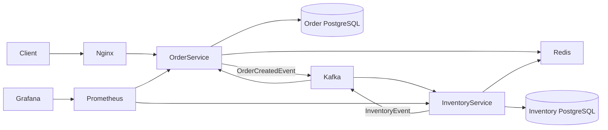

# FoodFlow

[](https://github.com/Alex11205/FoodFlowOrders/actions/workflows/basic-ci.yaml)

FoodFlow is an event-driven ordering backend built as two Spring Boot
microservices. An order is accepted as `PENDING`, inventory is reserved
asynchronously through Kafka, and the order eventually becomes `CONFIRMED` or
`REJECTED`.

## Architecture



The services share event schemas through the `event-contracts` Maven module,
while each service owns its application code, database, and Liquibase
migrations.

## Engineering Highlights

- Asynchronous order and inventory workflow using Apache Kafka
- Database-per-service persistence with PostgreSQL and Liquibase
- Idempotent event processing with durable event claims and Redis
- Kafka retries and dead-letter topics
- Redis-backed order caching
- Structured ECS-format application logs
- Spring Boot Actuator, Prometheus, and Grafana monitoring
- Unit and Testcontainers-based integration tests
- k6 tests for HTTP acceptance and end-to-end workflow latency
- Automated AWS deployment through GitHub OIDC, ECR, EC2, and SSM

## Tech Stack

- Java 21 and Spring Boot 4
- Kafka 4, PostgreSQL 16, Redis 7
- Maven, JUnit 5, Testcontainers, Liquibase
- Docker Compose and Nginx
- Prometheus, Grafana, and k6
- GitHub Actions and AWS

## Local Setup

Requirements:

- Docker Desktop with Docker Compose
- Maven and Java 21 for running tests outside containers

Create `db_password.txt` in the repository root containing a local PostgreSQL
password:

```text
replace-with-a-local-password
```

Start the complete stack:

```bash
docker compose up --build -d
docker compose ps
```

Create a sample inventory item:

```bash
docker compose exec -T inventory-db \
  psql -U postgres -d inventorydb -c "
INSERT INTO inventory(food_name, available_quantity)
VALUES ('sample-item', 100)
ON CONFLICT (food_name)
DO UPDATE SET available_quantity = EXCLUDED.available_quantity
RETURNING id, available_quantity;"
```

Use the returned inventory ID to create an order:

```bash
curl -X POST http://localhost:8080/orders \
  -H "Content-Type: application/json" \
  -d '{"foodId":1,"quantity":1}'
```

The initial response is `PENDING`. Poll the returned order ID:

```bash
curl http://localhost:8080/orders/1
```

Local endpoints:

- Order API: `http://localhost:8080`
- Order Swagger UI: `http://localhost:8080/swagger-ui/index.html`
- Order Actuator: `http://localhost:9001/actuator`
- Inventory Actuator: `http://localhost:9002/actuator`
- Grafana: `http://localhost:3000`

Stop the stack without deleting its named volumes:

```bash
docker compose down
```

## Tests

Run all Maven modules:

```bash
mvn clean verify
```

The service integration tests use disposable PostgreSQL Testcontainers. More
detail is available in [TESTING.md](TESTING.md).

Run the local k6 smoke test from PowerShell:

```powershell
.\load-tests\run.ps1 -Rate 1 -Duration 30s -PreAllocatedVUs 5 -MaxVUs 20
```

See [load-tests/README.md](load-tests/README.md) for the load scenarios and
database invariant checks.

## Measured EC2 Run

The following is a measured benchmark from the complete Docker Compose stack on
a single EC2 host. It is not presented as a production capacity guarantee.

| Metric | Result |
|---|---:|
| Target order rate | 10 orders/second |
| Duration | 5 minutes |
| Completed iterations | 3,001 |
| HTTP request failures | 0% |
| Dropped iterations | 0 |
| Create-order p95 | 19.99 ms |
| Completed workflow p95 | 255 ms |
| Terminal within 10 seconds | 99.93% |

All configured k6 thresholds passed. Two workflows exceeded the ten-second
polling window and require separate tracing before making a stronger
reliability claim.

Grafana dashboard:


## Deployment

Pushes to `master` run Maven verification, build commit-SHA-tagged Docker
images, and publish them to Amazon ECR. GitHub Actions authenticates to AWS
through OIDC and uses Systems Manager Run Command to deploy the same commit and
image tag to EC2.

Production uses `compose.prod.yaml`. PostgreSQL, Kafka, Redis, Actuator,
Prometheus, and Grafana are not publicly exposed; Grafana is accessed through an
SSM port-forwarding session.

## Repository Layout

```text
event-contracts/   Shared Kafka event records
foodflow/          Inventory service
foodfloworders/    Order service
load-tests/        k6 scenarios and runners
observability/     Prometheus configuration
deployment/        EC2 deployment script
```

## Current Scope

This deployment intentionally uses one EC2 host and one Kafka broker. Future
production-oriented work could add HTTPS, authentication, automated rollback,
transactional outbox publishing, and infrastructure as code.
